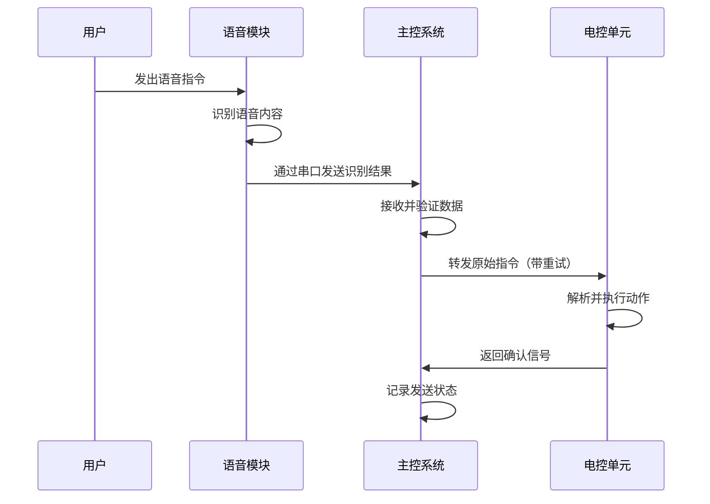
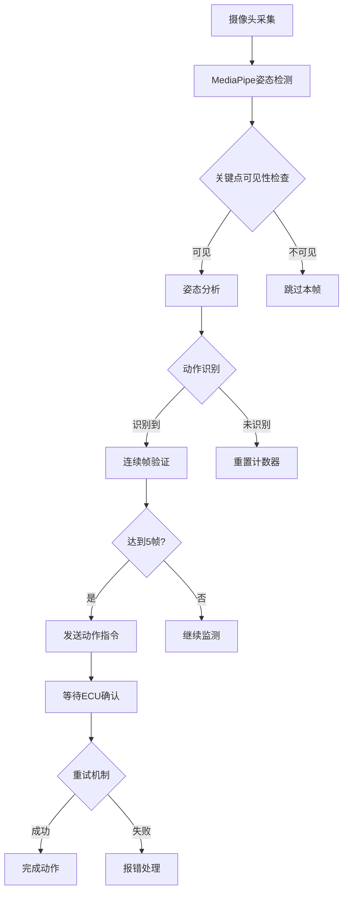

# 舞蹈机器人主控系统运行过程详解

## 项目概述

本舞蹈机器人主控系统是一个基于Python的复杂控制系统，通过整合视觉识别、语音识别和音乐识别功能，实现对机器人行为的智能控制。系统采用状态机设计模式，支持三种工作模式：语音识别模式、视觉识别模式、舞蹈模式。

## 系统架构

### 核心组件结构

```
舞蹈机器人主控系统
├── 主控单元 (main.py)
│   ├── 状态管理器 (current_mode)
│   ├── 事件处理器 (process_ecu_command)
│   └── 轮询调度器 (run_polling_tasks)
├── 通信模块 (serial_communication.py)
│   └── 重试机制 (send_command_with_retry)
├── 视觉识别模块 (vision_recognize.py)
│   ├── 姿态检测器 (VisionProcessor)
│   ├── 动作识别引擎 (_judge_pose)
│   └── 连续帧验证系统
└── 语音识别模块 (外置)
    └── 串口数据接收器
```

## 运行流程详解

### 1. 系统初始化阶段

#### 1.1 启动顺序
```
开始 → 加载配置 → 初始化视觉模块 → 初始化串口 → 进入主循环
```

#### 1.2 详细初始化过程

**步骤1：环境检查**
- 检查摄像头可用性
- 验证串口端口配置
- 加载MediaPipe模型

**步骤2：模块初始化**
```python
# VisionProcessor 初始化流程
1. 创建MediaPipe Pose实例
2. 打开摄像头设备（/dev/video0 或 COM1）
3. 设置检测参数（置信度阈值0.5）
4. 初始化连续帧计数器
5. 创建显示窗口

# 串口初始化流程
1. 配置ECU串口（COM1, 9600波特率）
2. 配置语音串口（COM2, 9600波特率）
3. 设置超时时间（0.1秒）
```

### 2. 主循环架构

#### 2.1 核心循环逻辑

系统采用**事件驱动 + 轮询**的混合架构：

```python
while True:
    # 高优先级：处理ECU事件
    ecu_data = read_ecu_serial()
    if ecu_data:
        process_ecu_command(ecu_data)
    
    # 轮询当前模式任务
    run_polling_tasks()
    
    # CPU保护延时
    sleep(0.01)
```

#### 2.3 每一次循环的详细运行逻辑

**单次循环执行流程（时间片：10ms）：**

```
┌─────────────────────────────────────────────────────────────┐
│                    主循环单次迭代                           │
│  ┌─────────────────────────────────────────────────────────┐ │
│  │ 1. ECU事件处理阶段（最高优先级）                        │ │
│  │    - 读取ECU串口数据（非阻塞，超时0.1s）               │ │
│  │    - 如果收到数据：                                     │ │
│  │      ├─ 解析指令类型（"1"/"2"/"3"/其他）               │ │
│  │      ├─ 执行模式切换逻辑                               │ │
│  │      ├─ 向ECU发送确认回执                             │ │
│  │      └─ 更新current_mode变量                          │ │
│  │    - 如果无数据：继续下一步                            │ │
│  └─────────────────────────────────────────────────────────┘ │
│                                                              │
│  ┌─────────────────────────────────────────────────────────┐ │
│  │ 2. 当前模式轮询阶段                                     │ │
│  │    根据current_mode值执行对应任务：                      │ │
│  │    ┌─────────────────────────────────────────────────┐ │ │
│  │    │ VOICE模式：                                       │ │ │
│  │    │   - 读取语音串口数据（非阻塞）                    │ │ │
│  │    │   - 如果收到数据：                                │ │ │
│  │    │     ├─ 提取语音指令字符串                        │ │ │
│  │    │     ├─ 调用send_command_with_retry发送给ECU      │ │ │
│  │    │     └─ 记录发送结果                              │ │ │
│  │    │   - 如果无数据：跳过                             │ │ │
│  │    └─────────────────────────────────────────────────┘ │ │
│  │    ┌─────────────────────────────────────────────────┐ │ │
│  │    │ VISION模式：                                      │ │ │
│  │    │   - 检查vision_processor是否可用                  │ │ │
│  │    │   - 调用process_one_frame()处理单帧               │ │ │
│  │    │   - 如果返回动作指令：                            │ │ │
│  │    │     ├─ 调用send_command_with_retry发送给ECU      │ │ │
│  │    │     ├─ 重置连续帧计数器                           │ │ │
│  │    │     └─ 记录识别结果                              │ │ │
│  │    │   - 如果返回None：继续监测                       │ │ │
│  │    └─────────────────────────────────────────────────┘ │ │
│  │    ┌─────────────────────────────────────────────────┐ │ │
│  │    │ DANCE模式：                                       │ │ │
│  │    │   - 当前为占位实现                                │ │ │
│  │    │   - 未来将实现：                                  │ │ │
│  │    │     ├─ 麦克风音频采集                            │ │ │
│  │    │     ├─ 音乐特征匹配                              │ │ │
│  │    │     └─ 发送音乐编号给ECU                         │ │ │
│  │    └─────────────────────────────────────────────────┘ │ │
│  │    ┌─────────────────────────────────────────────────┐ │ │
│  │    │ IDLE模式：                                        │ │ │
│  │    │   - 无操作，等待ECU指令                          │ │ │
│  │    └─────────────────────────────────────────────────┘ │ │
│  └─────────────────────────────────────────────────────────┘ │
│                                                              │
│  ┌─────────────────────────────────────────────────────────┐ │
│  │ 3. 资源清理检查阶段                                     │ │
│  │    - 检查是否有异常标志                                │ │
│  │    - 清理必要的临时资源                                │ │
│  │    - 准备下一次循环                                    │ │
│  └─────────────────────────────────────────────────────────┘ │
│                                                              │
│  ┌─────────────────────────────────────────────────────────┐ │
│  │ 4. CPU保护延时阶段                                      │ │
│  │    - sleep(0.01) 降低CPU占用                           │ │
│  │    - 确保10ms循环周期                                  │ │
│  └─────────────────────────────────────────────────────────┘ │
└─────────────────────────────────────────────────────────────┘
```

**循环性能指标：**

| 阶段 | 预期耗时 | 说明 |
|------|----------|------|
| ECU事件处理 | 0-2ms | 无数据时接近0ms |
| 语音模式轮询 | 0-1ms | 无数据时接近0ms |
| 视觉模式轮询 | 30-50ms | 包含摄像头采集+姿态检测 |
| 舞蹈模式轮询 | <1ms | 当前为占位实现 |
| CPU延时 | 10ms | 固定延时 |

**循环异常处理：**

```python
# 每次循环的异常处理逻辑
try:
    # 1. ECU事件处理
    ecu_data = ecu_serial.readline().decode('utf-8').strip()
    if ecu_data:
        process_ecu_command(ecu_data)

    # 2. 模式轮询
    run_polling_tasks()

    # 3. CPU保护
    time.sleep(0.01)

except KeyboardInterrupt:
    # 用户中断处理
    print("程序被用户中断")
    break

except serial.SerialException as e:
    # 串口异常处理
    print(f"串口异常: {e}")
    # 尝试重新连接或进入安全模式

except Exception as e:
    # 其他异常处理
    print(f"未知异常: {e}")
    # 记录日志，继续运行
```

**状态变量更新：**

每次循环都会检查/更新的关键变量：
- `current_mode`: 当前工作模式状态
- `vision_processor`: 视觉模块实例状态
- `ecu_serial/voice_serial`: 串口连接状态
- 各模块内部的状态计数器

#### 2.2 状态机转换图

**状态转换表：**

| 当前模式 | 收到指令 | 转换模式 | 描述 |
|----------|----------|----------|------|
| 待机模式(IDLE) | "1" | 语音识别模式(VOICE) | 切换到语音控制 |
| 待机模式(IDLE) | "2" | 视觉识别模式(VISION) | 切换到视觉控制 |
| 待机模式(IDLE) | "3" | 舞蹈模式(DANCE) | 切换到舞蹈控制 |
| 语音识别模式(VOICE) | "1" | 语音识别模式(VOICE) | 保持当前模式 |
| 语音识别模式(VOICE) | "2" | 视觉识别模式(VISION) | 切换到视觉控制 |
| 语音识别模式(VOICE) | "3" | 舞蹈模式(DANCE) | 切换到舞蹈控制 |
| 视觉识别模式(VISION) | "1" | 语音识别模式(VOICE) | 切换到语音控制 |
| 视觉识别模式(VISION) | "2" | 视觉识别模式(VISION) | 保持当前模式 |
| 视觉识别模式(VISION) | "3" | 舞蹈模式(DANCE) | 切换到舞蹈控制 |
| 舞蹈模式(DANCE) | "1" | 语音识别模式(VOICE) | 切换到语音控制 |
| 舞蹈模式(DANCE) | "2" | 视觉识别模式(VISION) | 切换到视觉控制 |
| 舞蹈模式(DANCE) | "3" | 舞蹈模式(DANCE) | 保持当前模式 |

**状态转换示意图：**

```
                ┌─────────────────┐
                │   待机模式      │
                │   MODE_IDLE     │
                └────────┬────────┘
                         │
            ┌────────────┼────────────┐
            │            │            │
         收到"1"      收到"2"      收到"3"
            │            │            │
            ▼            ▼            ▼
┌─────────────────┐┌─────────────────┐┌─────────────────┐
│  语音识别模式   ││  视觉识别模式   ││   舞蹈模式      │
│  MODE_VOICE     ││  MODE_VISION    ││  MODE_DANCE     │
└─────────────────┘└─────────────────┘└─────────────────┘
```

### 3. 工作模式详细流程

#### 3.1 语音识别模式

**工作流程图：**


**详细步骤：**
1. **监听阶段**：主控通过`voice_serial`持续监听语音模块
2. **数据接收**：使用非阻塞读取`readline()`获取语音数据
3. **数据验证**：检查数据完整性，去除空白字符
4. **指令转发**：调用`send_command_with_retry`发送给ECU
5. **重试机制**：最多重试3次，超时1.5秒
6. **状态确认**：等待ECU返回相同指令作为确认

#### 3.2 视觉识别模式

**核心处理流程：**


**姿态识别算法详解：**

**大字站识别：**
```python
# 检查条件链
1. 四肢伸直验证：
   - 左臂角度 > 160°
   - 右臂角度 > 160°
   - 左腿角度 > 160°
   - 右腿角度 > 160°

2. 手臂水平验证：
   - 手腕与肩膀Y坐标差 < 0.1

3. 双腿分开验证：
   - 脚踝间距 > 肩宽 × 1.2
```

**弓箭步识别：**
```python
# 左右弓步分别检测
# 左弓步条件：
左腿弯曲角度：90° < angle < 165°
右腿伸直角度：angle > 160°
左手臂上扬：手腕Y < 肩膀Y
右手臂下放：手腕Y > 肩膀Y
双臂伸直：角度 > 150°
```

**连续帧验证机制：**
- 需要连续5帧识别到相同动作
- 防止误触发和抖动
- 识别成功后自动重置计数器

#### 3.3 舞蹈模式

**当前状态：**
- 框架已搭建（handle_dance_mode函数）
- 具体实现待完成（TODO标记）
- 预期功能：音乐识别 + 编号发送

### 4. 通信协议详解

#### 4.1 串口配置
```
ECU串口：
- 端口：COM1（可配置）
- 波特率：9600 bps
- 数据位：8位
- 停止位：1位
- 超时：0.1秒

语音串口：
- 端口：COM2（可配置）
- 波特率：9600 bps
- 超时：0.1秒
```

#### 4.2 指令格式

**模式切换指令：**
- "1" → 语音识别模式
- "2" → 视觉识别模式
- "3" → 舞蹈模式

**动作指令：**
- "dazizhan" → 大字站
- "gongjianbu" → 弓箭步
- "jushuangshou" → 举双手
- "dunxia" → 蹲下
- "biaixin" → 比爱心
- "fuwocheng" → 俯卧撑

#### 4.3 重试机制详解

```python
# 重试参数
RETRY_ATTEMPTS = 3          # 最大尝试次数
RETRY_TIMEOUT_SECONDS = 1.5 # 单次超时时间

# 重试流程
1. 发送指令
2. 等待1.5秒确认
3. 超时则重试
4. 收到匹配确认即成功
5. 3次失败后报错
```

### 5. 错误处理机制

#### 5.1 异常分类

**硬件异常：**
- 摄像头无法打开
- 串口连接失败
- 设备权限不足

**通信异常：**
- 串口读写错误
- 超时未响应
- 数据格式错误

**算法异常：**
- 关键点检测失败
- 姿态识别错误
- 连续帧验证失败

#### 5.2 处理策略

```python
# 视觉模块异常处理
try:
    vision_processor = VisionProcessor()
except Exception as e:
    print("视觉模块初始化失败")
    vision_processor = None  # 降级处理

# 串口异常处理
try:
    ecu_serial = serial.Serial(...)
except SerialException as e:
    print("串口初始化失败")
    cleanup_and_exit()

# 运行时异常处理
try:
    main_loop()
except KeyboardInterrupt:
    graceful_shutdown()
except Exception as e:
    log_error_and_recover()
```

### 6. 性能优化

#### 6.1 CPU使用优化
- 主循环添加10ms延时
- 非阻塞串口读取
- 按需初始化视觉模块

#### 6.2 内存管理
- 及时释放摄像头资源
- 关闭OpenCV窗口
- 异常时清理资源

#### 6.3 响应延迟
- 视觉识别：单帧处理约50-100ms
- 串口通信：单次往返约20-50ms
- 连续帧验证：5帧约250-500ms

### 7. 调试与监控

#### 7.1 日志输出
- 模式切换信息
- 指令发送状态
- 错误告警信息
- 性能统计信息

#### 7.2 可视化调试
- OpenCV实时显示窗口
- 关键点标注
- 识别状态叠加显示
- 连续帧计数器显示

#### 7.3 测试模式
```bash
# 独立测试视觉模块
python vision_recognize.py

# 独立测试通信模块
python serial_communication.py

# 完整系统测试
python main.py
```

## 部署注意事项

### 硬件要求
- USB摄像头（支持640x480@30fps）
- 两个可用串口（或USB转串口）
- 树莓派4B或同等性能设备

### 软件依赖
```
opencv-python >= 4.5.0
mediapipe >= 0.8.0
pyserial >= 3.5
numpy >= 1.19.0
```

### 配置调整
- 根据实际情况修改串口端口名
- 调整置信度阈值优化识别效果
- 根据性能调整连续帧参数

### 安全机制
- 异常自动恢复
- 资源自动清理
- 手动中断处理（Ctrl+C）

## 总结

本舞蹈机器人系统采用模块化设计，通过清晰的状态管理和健壮的通信机制，实现了复杂的多模态交互功能。系统具有良好的扩展性，可以轻松添加新的动作识别或工作模式。