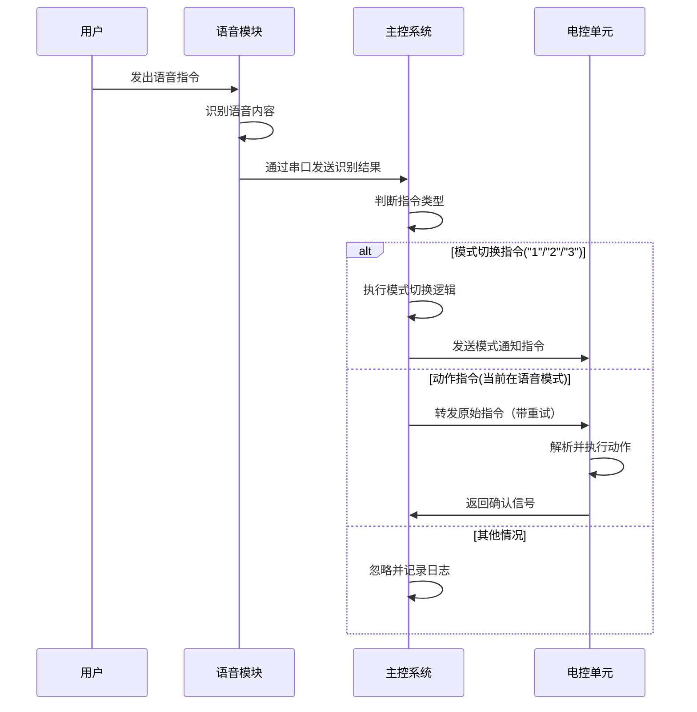
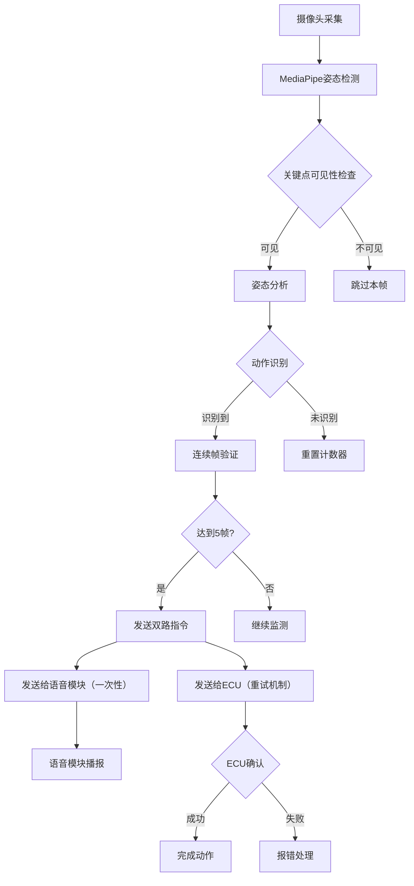
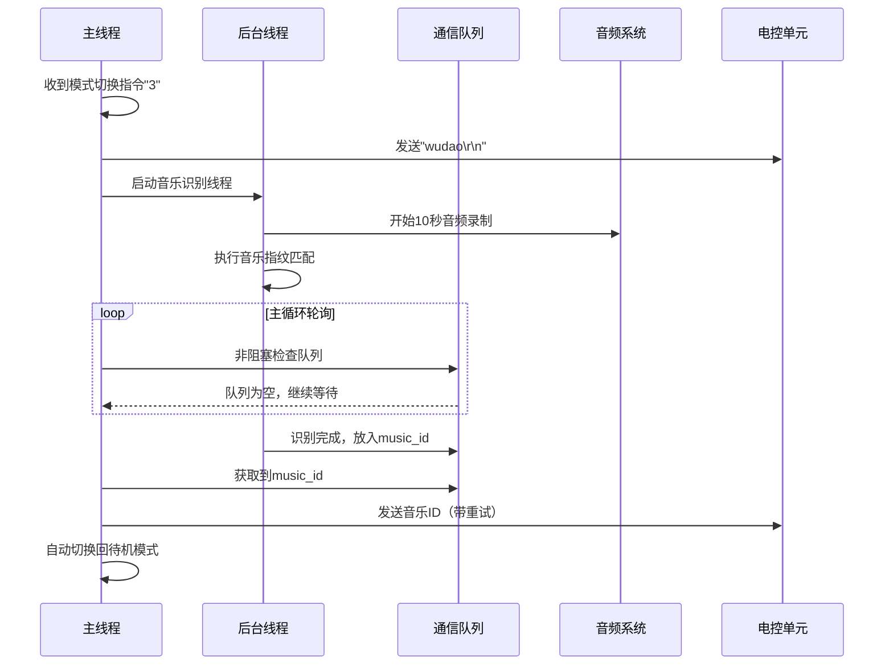

# 舞蹈机器人主控系统运行过程详解

## 项目概述

本舞蹈机器人主控系统是一个基于Python的复杂控制系统，通过整合视觉识别、语音识别和音乐识别功能，实现对机器人行为的智能控制。系统采用状态机设计模式，支持四种工作模式：待机模式、语音识别模式、视觉识别模式、舞蹈模式。特别地，舞蹈模式采用异步线程架构，避免阻塞主循环。

## 系统架构

### 核心组件结构

```
舞蹈机器人主控系统
├── 主控单元 (main.py)
│   ├── 状态管理器 (current_mode)
│   ├── 事件处理器 (process_mode_switch_command)
│   ├── 轮询调度器 (run_polling_tasks)
│   └── 异步任务管理器 (music_thread + queue)
├── 通信模块 (serial_communication.py)
│   ├── 重试机制 (send_command_with_retry)
│   └── 一次性发送 (send_command_fire_and_forget)
├── 视觉识别模块 (vision_recognize.py)
│   ├── 姿态检测器 (VisionProcessor)
│   ├── 动作识别引擎 (_judge_pose)
│   └── 连续帧验证系统
├── 音乐识别模块 (music_recognizer.py)
│   ├── 音频录制器 (audio_recorder)
│   ├── 指纹生成器 (fingerprint_generator)
│   └── 识别核心 (recognize_music)
└── 语音识别模块 (外置)
    └── 串口数据接收器
```

## 运行流程详解

### 1. 系统初始化阶段

#### 1.1 启动顺序
```
开始 → 加载配置 → 初始化视觉模块 → 初始化串口 → 进入主循环
```

#### 1.2 详细初始化过程

**步骤1：环境检查**
- 检查摄像头可用性
- 验证串口端口配置
- 加载MediaPipe模型

**步骤2：模块初始化**
```python
# VisionProcessor 初始化流程
1. 创建MediaPipe Pose实例
2. 打开摄像头设备（/dev/video0 或默认设备）
3. 设置检测参数（置信度阈值0.5）
4. 初始化连续帧计数器
5. 创建显示窗口

# 串口初始化流程
1. 配置ECU串口（COM1, 9600波特率）
2. 配置语音串口（COM4, 9600波特率）
3. 设置超时时间（0.1秒）

# 异步任务初始化
1. 创建线程间通信队列 (music_result_queue)
2. 初始化线程控制事件 (stop_music_thread)
3. 设置线程引用变量 (music_thread)
```

### 2. 主循环架构

#### 2.1 核心循环逻辑

系统采用**语音事件驱动 + 轮询**的混合架构：

```python
while True:
    # 高优先级：处理语音模块事件（包括模式切换）
    voice_data = read_voice_serial()
    if voice_data:
        if voice_data in ['1', '2', '3']:
            process_mode_switch_command(voice_data)
        elif current_mode == MODE_VOICE:
            # 转发语音指令到ECU
            send_command_with_retry(ecu_serial, voice_data)
    
    # 监听ECU异步数据（日志记录）
    ecu_data = read_ecu_serial()
    if ecu_data:
        log_ecu_message(ecu_data)
    
    # 轮询当前模式任务
    run_polling_tasks()
    
    # CPU保护延时
    sleep(0.01)
```

#### 2.3 每一次循环的详细运行逻辑

**单次循环执行流程（时间片：10ms）：**

```
┌─────────────────────────────────────────────────────────────┐
│                    主循环单次迭代                           │
│  ┌─────────────────────────────────────────────────────────┐ │
│  │ 1. 语音模块事件处理阶段（最高优先级）                   │ │
│  │    - 读取语音串口数据（非阻塞，超时0.1s）               │ │
│  │    - 如果收到数据：                                     │ │
│  │      ├─ 判断是否为模式切换指令（"1"/"2"/"3"）           │ │
│  │      ├─ 如果是模式切换：执行process_mode_switch_command │ │
│  │      ├─ 如果是语音模式动作指令：转发给ECU               │ │
│  │      └─ 其他情况：忽略并记录日志                        │ │
│  │    - 如果无数据：继续下一步                            │ │
│  └─────────────────────────────────────────────────────────┘ │
│                                                              │
│  ┌─────────────────────────────────────────────────────────┐ │
│  │ 2. ECU异步数据监听阶段                                   │ │
│  │    - 读取ECU串口数据（非阻塞，超时0.1s）               │ │
│  │    - 如果收到数据：记录为异步消息（主要用于日志）        │ │
│  │    - 注意：ECU回执在send_command_with_retry中处理       │ │
│  └─────────────────────────────────────────────────────────┘ │
│                                                              │
│  ┌─────────────────────────────────────────────────────────┐ │
│  │ 3. 当前模式轮询阶段                                     │ │
│  │    根据current_mode值执行对应任务：                      │ │
│  │    ┌─────────────────────────────────────────────────┐ │ │
│  │    │ VOICE模式：                                       │ │ │
│  │    │   - 语音指令已在阶段1处理                        │ │ │
│  │    │   - 此阶段无额外轮询任务                          │ │ │
│  │    └─────────────────────────────────────────────────┘ │ │
│  │    ┌─────────────────────────────────────────────────┐ │ │
│  │    │ VISION模式：                                      │ │ │
│  │    │   - 检查vision_processor是否可用                  │ │ │
│  │    │   - 调用process_one_frame()处理单帧               │ │ │
│  │    │   - 如果返回动作指令：                            │ │ │
│  │    │     ├─ 发送给语音模块（一次性）                   │ │ │
│  │    │     ├─ 发送给ECU（带重试机制）                   │ │ │
│  │    │     └─ 记录识别结果                              │ │ │
│  │    │   - 如果返回None：继续监测                       │ │ │
│  │    └─────────────────────────────────────────────────┘ │ │
│  │    ┌─────────────────────────────────────────────────┐ │ │
│  │    │ DANCE模式：                                       │ │ │
│  │    │   - 非阻塞检查音乐识别队列                        │ │ │
│  │    │   - 如果队列有结果：                              │ │ │
│  │    │     ├─ 获取音乐ID                                │ │ │
│  │    │     ├─ 发送给ECU（带重试机制）                   │ │ │
│  │    │     └─ 自动切换回待机模式                         │ │ │
│  │    │   - 如果队列空：等待后台线程完成                  │ │ │
│  │    └─────────────────────────────────────────────────┘ │ │
│  │    ┌─────────────────────────────────────────────────┐ │ │
│  │    │ IDLE模式：                                        │ │ │
│  │    │   - 无操作，等待语音模块指令                      │ │ │
│  │    └─────────────────────────────────────────────────┘ │ │
│  └─────────────────────────────────────────────────────────┘ │
│                                                              │
│  ┌─────────────────────────────────────────────────────────┐ │
│  │ 4. CPU保护延时阶段                                      │ │
│  │    - sleep(0.01) 降低CPU占用                           │ │
│  │    - 确保10ms循环周期                                  │ │
│  └─────────────────────────────────────────────────────────┘ │
└─────────────────────────────────────────────────────────────┘
```

**循环性能指标：**

| 阶段 | 预期耗时 | 说明 |
|------|----------|------|
| 语音事件处理 | 0-2ms | 无数据时接近0ms |
| ECU异步监听 | 0-1ms | 无数据时接近0ms |
| 视觉模式轮询 | 30-50ms | 包含摄像头采集+姿态检测 |
| 舞蹈模式轮询 | <1ms | 非阻塞队列检查 |
| 语音模式轮询 | 0ms | 已在事件处理阶段完成 |
| CPU延时 | 10ms | 固定延时 |

**循环异常处理：**

```python
# 每次循环的异常处理逻辑
try:
    # 1. 语音模块事件处理
    voice_data = voice_serial.readline().decode('utf-8').strip()
    if voice_data:
        if voice_data in ['1', '2', '3']:
            process_mode_switch_command(voice_data)
        elif current_mode == MODE_VOICE:
            send_command_with_retry(ecu_serial, voice_data)

    # 2. ECU异步数据监听
    ecu_data = ecu_serial.readline().decode('utf-8').strip()
    if ecu_data:
        print(f"收到ECU异步数据: {ecu_data}")

    # 3. 模式轮询
    run_polling_tasks()

    # 4. CPU保护
    time.sleep(0.01)

except KeyboardInterrupt:
    # 用户中断处理
    print("程序被用户中断")
    break

except serial.SerialException as e:
    # 串口异常处理
    print(f"串口异常: {e}")
    # 尝试重新连接或进入安全模式

except Exception as e:
    # 其他异常处理
    print(f"主循环发生未知错误: {e}")
    break  # 严重错误时退出主循环
```

**状态变量更新：**

每次循环都会检查/更新的关键变量：
- `current_mode`: 当前工作模式状态
- `vision_processor`: 视觉模块实例状态
- `ecu_serial/voice_serial`: 串口连接状态
- `music_thread`: 音乐识别线程状态
- `music_result_queue`: 线程间通信队列
- `stop_music_thread`: 线程控制事件
- 各模块内部的状态计数器

#### 2.2 状态机转换图

**状态转换表：**

| 当前模式 | 收到指令 | 转换模式 | 描述 |
|----------|----------|----------|------|
| 待机模式(IDLE) | "1" | 语音识别模式(VOICE) | 切换到语音控制 |
| 待机模式(IDLE) | "2" | 视觉识别模式(VISION) | 切换到视觉控制 |
| 待机模式(IDLE) | "3" | 舞蹈模式(DANCE) | 切换到舞蹈控制 |
| 语音识别模式(VOICE) | "1" | 语音识别模式(VOICE) | 保持当前模式 |
| 语音识别模式(VOICE) | "2" | 视觉识别模式(VISION) | 切换到视觉控制 |
| 语音识别模式(VOICE) | "3" | 舞蹈模式(DANCE) | 切换到舞蹈控制 |
| 视觉识别模式(VISION) | "1" | 语音识别模式(VOICE) | 切换到语音控制 |
| 视觉识别模式(VISION) | "2" | 视觉识别模式(VISION) | 保持当前模式 |
| 视觉识别模式(VISION) | "3" | 舞蹈模式(DANCE) | 切换到舞蹈控制 |
| 舞蹈模式(DANCE) | "1" | 语音识别模式(VOICE) | 切换到语音控制 |
| 舞蹈模式(DANCE) | "2" | 视觉识别模式(VISION) | 切换到视觉控制 |
| 舞蹈模式(DANCE) | "3" | 舞蹈模式(DANCE) | 保持当前模式 |

**状态转换示意图：**

```
                ┌─────────────────┐
                │   待机模式      │
                │   MODE_IDLE     │
                └────────┬────────┘
                         │
            ┌────────────┼────────────┐
            │            │            │
         收到"1"      收到"2"      收到"3"
            │            │            │
            ▼            ▼            ▼
┌─────────────────┐┌─────────────────┐┌─────────────────┐
│  语音识别模式   ││  视觉识别模式   ││   舞蹈模式      │
│  MODE_VOICE     ││  MODE_VISION    ││  MODE_DANCE     │
└─────────────────┘└─────────────────┘└─────────────────┘
```

### 3. 工作模式详细流程

#### 3.1 语音识别模式

**工作流程图：**


**详细步骤：**
1. **监听阶段**：主控通过`voice_serial`在主循环中持续监听语音模块
2. **数据接收**：使用非阻塞读取`readline()`获取语音数据
3. **指令分类**：
   - 模式切换指令（'1', '2', '3'）→ 执行模式切换
   - 动作指令（仅在语音模式下）→ 转发给ECU
   - 其他指令 → 忽略并记录
4. **指令转发**：调用`send_command_with_retry`发送给ECU（添加\r\n后缀）
5. **重试机制**：最多重试3次，超时1.5秒
6. **状态确认**：等待ECU返回相同指令作为确认

#### 3.2 视觉识别模式

**核心处理流程：**


**双路通信机制：**
视觉识别模式的特殊之处在于同时向两个模块发送指令：
1. **语音模块通信**：
   - 使用`send_command_fire_and_forget`一次性发送
   - 不等待确认，不重试
   - 主要用于语音播报功能

2. **ECU通信**：
   - 使用`send_command_with_retry`可靠发送
   - 带重试机制，确保执行
   - 用于实际动作控制

**姿态识别算法详解：**

**大字站识别：**
```python
# 检查条件链
1. 四肢伸直验证：
   - 左臂角度 > 160°
   - 右臂角度 > 160°
   - 左腿角度 > 160°
   - 右腿角度 > 160°

2. 手臂水平验证：
   - 手腕与肩膀Y坐标差 < 0.1

3. 双腿分开验证：
   - 脚踝间距 > 肩宽 × 1.2
```

**弓箭步识别：**
```python
# 左右弓步分别检测
# 左弓步条件：
左腿弯曲角度：90° < angle < 165°
右腿伸直角度：angle > 160°
左手臂上扬：手腕Y < 肩膀Y
右手臂下放：手腕Y > 肩膀Y
双臂伸直：角度 > 150°
```

**连续帧验证机制：**
- 需要连续5帧识别到相同动作
- 防止误触发和抖动
- 识别成功后自动重置计数器

#### 3.3 舞蹈模式（异步架构）

**异步处理架构：**


**实现细节：**

1. **进入舞蹈模式**：
   ```python
   # 模式切换
   switch_to_mode(MODE_DANCE, "舞蹈", "wudao\r\n")
   
   # 启动后台线程
   stop_music_thread.clear()
   music_thread = threading.Thread(target=background_recognize_task)
   music_thread.start()
   ```

2. **后台音乐识别线程**：
   ```python
   def background_recognize_task():
       print("[后台线程] 开始执行音乐识别...")
       music_id = recognize_music(duration=10)  # 10秒录制识别
       
       if not stop_music_thread.is_set():
           music_result_queue.put(music_id)  # 结果放入队列
       else:
           print("[后台线程] 主线程已请求停止，丢弃结果")
   ```

3. **主线程轮询处理**：
   ```python
   def handle_dance_mode():
       try:
           music_id = music_result_queue.get_nowait()  # 非阻塞获取
           if music_id:
               send_command_with_retry(ecu_serial, f"{music_id}\r\n")
           current_mode = MODE_IDLE  # 自动切换回待机
       except queue.Empty:
           pass  # 队列空，继续等待
   ```

4. **线程同步机制**：
   - `music_result_queue`: 线程间通信队列
   - `stop_music_thread`: 线程停止事件
   - `music_thread`: 线程引用，用于生命周期管理

5. **异常处理**：
   - 切换出舞蹈模式时自动停止后台线程
   - 清空队列中的残留结果
   - 程序退出时等待线程结束

### 4. 通信协议详解

#### 4.1 串口配置
```
ECU串口：
- 端口：COM1（可配置）
- 波特率：9600 bps
- 数据位：8位
- 停止位：1位
- 超时：0.1秒

语音串口：
- 端口：COM4（可配置）
- 波特率：9600 bps
- 超时：0.1秒
```

#### 4.2 指令格式

**模式切换指令（来自语音模块）：**
- "1" → 语音识别模式
- "2" → 视觉识别模式  
- "3" → 舞蹈模式

**ECU模式通知指令（主控→ECU）：**
- "yuyin\r\n" → 通知ECU进入语音模式
- "shijue\r\n" → 通知ECU进入视觉模式
- "wudao\r\n" → 通知ECU进入舞蹈模式

**动作指令（统一添加\r\n后缀）：**
- "dazizhan\r\n" → 大字站
- "gongjianbu\r\n" → 弓箭步
- "jushuangshou\r\n" → 举双手
- "dunxia\r\n" → 蹲下
- "biaixin\r\n" → 比爱心
- "fuwocheng\r\n" → 俯卧撑

**音乐指令（舞蹈模式）：**
- "{music_id}\r\n" → 识别到的音乐编号

#### 4.3 通信机制详解

**双重通信策略：**

1. **重试机制（send_command_with_retry）**：
   ```python
   # 用于关键指令：模式切换、动作执行、音乐指令
   RETRY_ATTEMPTS = 3          # 最大尝试次数
   RETRY_TIMEOUT_SECONDS = 1.5 # 单次超时时间
   
   # 重试流程
   1. 发送指令到ECU
   2. 等待1.5秒确认
   3. 超时则重试
   4. 收到匹配确认即成功
   5. 3次失败后报错
   ```

2. **一次性发送（send_command_fire_and_forget）**：
   ```python
   # 用于非关键通知：视觉→语音播报
   1. 发送指令
   2. 不等待确认
   3. 不重试
   4. 立即返回
   ```

**指令路由规则：**
- 语音模式：语音模块 → 主控 → ECU（重试）
- 视觉模式：视觉模块 → 主控 → 语音模块（一次性） + ECU（重试）
- 舞蹈模式：音乐模块 → 主控 → ECU（重试）

### 5. 错误处理机制

#### 5.1 异常分类

**硬件异常：**
- 摄像头无法打开
- 串口连接失败
- 设备权限不足

**通信异常：**
- 串口读写错误
- 超时未响应
- 数据格式错误

**算法异常：**
- 关键点检测失败
- 姿态识别错误
- 连续帧验证失败

#### 5.2 处理策略

```python
# 视觉模块异常处理
try:
    vision_processor = VisionProcessor()
except Exception as e:
    print("视觉模块初始化失败")
    vision_processor = None  # 降级处理

# 串口异常处理
try:
    ecu_serial = serial.Serial(...)
except SerialException as e:
    print("串口初始化失败")
    cleanup_and_exit()

# 运行时异常处理
try:
    main_loop()
except KeyboardInterrupt:
    graceful_shutdown()
except Exception as e:
    log_error_and_recover()
```

### 6. 性能优化

#### 6.1 CPU使用优化
- 主循环添加10ms延时
- 非阻塞串口读取
- 按需初始化视觉模块

#### 6.2 内存管理
- 及时释放摄像头资源
- 关闭OpenCV窗口
- 异常时清理资源

#### 6.3 响应延迟
- 视觉识别：单帧处理约50-100ms
- 串口通信：单次往返约20-50ms
- 连续帧验证：5帧约250-500ms

### 7. 调试与监控

#### 7.1 日志输出
- 模式切换信息
- 指令发送状态
- 错误告警信息
- 性能统计信息

#### 7.2 可视化调试
- OpenCV实时显示窗口
- 关键点标注
- 识别状态叠加显示
- 连续帧计数器显示

#### 7.3 测试模式
```bash
# 独立测试视觉模块
python vision_recognize.py

# 独立测试通信模块
python serial_communication.py

# 完整系统测试
python main.py
```

## 部署注意事项

### 硬件要求
- USB摄像头（支持640x480@30fps）
- 两个可用串口（或USB转串口）
- 树莓派4B或同等性能设备

### 软件依赖
```
opencv-python >= 4.5.0
mediapipe >= 0.8.0
pyserial >= 3.5
numpy >= 1.19.0
```

### 配置调整
- 根据实际情况修改串口端口名
- 调整置信度阈值优化识别效果
- 根据性能调整连续帧参数

### 安全机制
- 异常自动恢复
- 资源自动清理
- 手动中断处理（Ctrl+C）

## 总结

本舞蹈机器人系统采用模块化设计，通过清晰的状态管理和健壮的通信机制，实现了复杂的多模态交互功能。特别地，系统在舞蹈模式下采用异步线程架构，避免阻塞主循环，确保系统响应性。

**系统特色：**
1. **事件驱动架构**：语音模块作为主要事件源，驱动模式切换
2. **异步处理能力**：舞蹈模式使用后台线程处理耗时的音乐识别
3. **双重通信策略**：关键指令使用重试机制，非关键通知使用一次性发送
4. **强制模式切换**：即使ECU无响应也会切换模式，提高系统鲁棒性
5. **完善的资源管理**：线程安全的启动和停止机制

**通信流向总结：**
- **语音模块 → 主控**：模式切换指令 + 动作指令
- **主控 → ECU**：模式通知 + 动作指令 + 音乐指令（带重试）
- **主控 → 语音模块**：视觉识别结果播报（一次性）
- **视觉模块 → 主控**：动作识别结果
- **音乐模块 → 主控**：音乐识别结果（通过队列）

系统具有良好的扩展性，可以轻松添加新的识别模式或优化现有的异步处理机制。